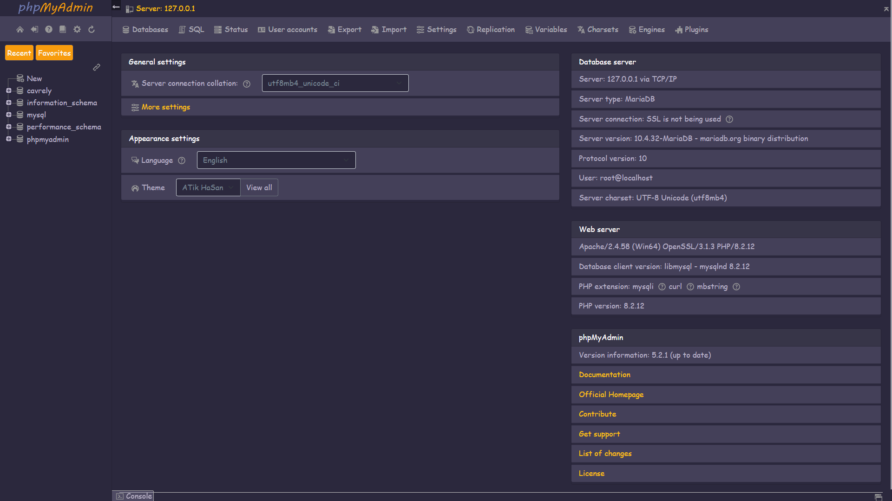

# DarkOrange phpMyAdmin Theme

Welcome to the DarkOrange phpMyAdmin Theme! This theme is designed to enhance the visual aesthetics of phpMyAdmin, offering a more user-friendly and visually appealing interface.



## Features

- Modern and responsive design
- Easy to install
- Compatible with the latest version of phpMyAdmin
- Lightweight and fast-loading

---

## Installation Guide

### Step 1: Download the Theme

1. Clone the repository or download the ZIP file:

   ```bash
   git clone https://github.com/atikhasan392/phpmyadmin-theme.git
   ```

2. Alternatively, download the ZIP file from the [Releases](https://github.com/atikhasan392/phpmyadmin-theme) section.

### Step 2: Locate phpMyAdmin Themes Directory

1. Navigate to the phpMyAdmin installation directory on your PC.
2. Open the `themes` folder. The typical path is:

   ```bash
   C:/xampp/phpmyadmin/themes/
   ```

### Step 3: Upload the Theme

1. Extract the downloaded ZIP file (if applicable).
2. Copy the entire folder of the customized theme to the `themes` directory.
   Example:

   ```bash
   cp -r phpmyadmin-theme C:/xampp/phpmyadmin/themes/
   ```

### Step 4: Activate the Theme

1. Log in to phpMyAdmin.
2. Go to **Settings** (usually found in the top-right corner).
3. Under the **Appearance** tab, locate the theme dropdown menu.
4. Select the new theme from the list.
5. Save your changes.

---

## Screenshots

Include screenshots here to showcase your theme. Add them to a `screenshots` folder in the repository.

---

## Feedback and Contributions

Feel free to provide feedback or suggest improvements by opening an issue or submitting a pull request.

---

## License

This project is licensed under the [MIT License](LICENSE).

---

For any questions or support, contact [ATik HaSan](mailto:atikhasan2700@gmail.com).

Thank you for using the Customized phpMyAdmin Theme!
